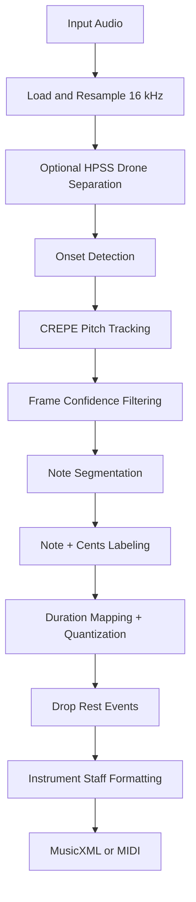

# Kaban

Microtonal pitch detection CLI for monophonic Arabic and Somali audio.

Kaban uses the [CREPE](https://github.com/maxrmorrison/torchcrepe) neural pitch detection model to accurately detect pitch — including microtones smaller than a semitone — and outputs note sequences with cent-level precision (e.g., `A4+30c`) rather than snapping to the Western 12-tone equal temperament grid.

## Features

- **CREPE pitch detection** via [torchcrepe](https://github.com/maxrmorrison/torchcrepe) (PyTorch)
- **Cent-level precision** — preserves microtonal detail in maqam and Somali scales
- **Drone separation** — HPSS preprocessing isolates the melody from background drones
- **Onset detection** — separates repeated strikes of the same pitch
- **Overlapping chunked processing** — handles long audio files without memory issues
- **Fine-tuning pipeline** — adapt the CREPE model to your instrument

## Installation

```bash
git clone https://github.com/mohamedainab/kaban.git
cd kaban
python3 -m venv .venv
source .venv/bin/activate
pip install -r requirements.txt
```

For M4A/AAC support, install ffmpeg:

```bash
brew install ffmpeg    # macOS
sudo apt install ffmpeg  # Ubuntu/Debian
```

## Usage

### Basic pitch detection

```bash
python src/kaban.py audio.wav
```

### Output formats

```bash
# Table (default)
python src/kaban.py audio.wav

# JSON
python src/kaban.py audio.wav --format json

# MusicXML sheet export
python src/kaban.py audio.wav --sheet-format musicxml

# MIDI export
python src/kaban.py audio.wav --sheet-format midi

# Piano grand-staff MusicXML export
python src/kaban.py audio.wav --sheet-format musicxml --instrument piano

# Export both MusicXML and MIDI
python src/kaban.py audio.wav --sheet-format both

# Simplified Arabic Oud lead sheet
python src/kaban.py audio.wav --sheet-format musicxml --instrument guitar --simplify-sheet

# Faithful Arabic Oud sheet with less export-time reduction
python src/kaban.py audio.wav --sheet-format musicxml --instrument guitar --no-simplify-sheet
```

### Options

| Flag | Default | Description |
|------|---------|-------------|
| `--model-capacity` | `full` | CREPE model size (`tiny` or `full`) |
| `--model-path` | — | Path to a fine-tuned `.pth` model |
| `--confidence-threshold` | `0.3` | Minimum CREPE confidence (0–1) |
| `--step-size` | `10` | Frame step size in ms |
| `--cent-tolerance` | `35` | Cent distance to trigger a new note |
| `--min-duration` | `0.03` | Minimum note duration in seconds |
| `--min-rest` | `0.15` | Rests shorter than this are absorbed |
| `--no-drone-separation` | — | Skip HPSS drone removal |
| `--sample-rate` | `16000` | Audio resampling rate in Hz |
| `--format` | `table` | Output format (`table` or `json`) |
| `--sheet-format` | — | Export score (`musicxml`, `midi`, or `both`) |
| `--sheet-output` | auto | Score output path (for `both`, acts as stem/base name) |
| `--sheet-tempo` | `90` | Tempo used for score duration mapping |
| `--instrument` | `guitar` | Sheet profile (`guitar` = Arabic Oud lead, or `piano`) |
| `--simplify-sheet` | on for `guitar` | Apply an Oud-focused simplification preset before export |
| `--no-simplify-sheet` | off | Disable default Oud/guitar simplification for a more faithful export |

### Example output

```
   Start       End     Dur  Note                 Hz   Conf
----------------------------------------------------------
   0.130     1.240   1.110  G3-6c            195.28  0.903
   1.250     1.590   0.340  G3+6c            196.67  0.886
   2.030     2.370   0.340  Ab3-16c          205.79  0.857
   2.390     2.490   0.100  Bb3-11c          231.61  0.697
   3.480     4.070   0.590  F3+5c            175.11  0.768
   4.100     4.310   0.210  Eb3+5c           155.98  0.653
```

## Fine-tuning

You can fine-tune the CREPE model on your own recordings to improve accuracy for specific instruments.

### Step 1 — Generate annotations

```bash
python src/finetune.py generate data/audio/recording.m4a -o data/text/recording.csv
```

This creates a CSV with columns: `time`, `frequency_hz`, `note`, `confidence`.

### Step 2 — Correct the CSV

Open the CSV and fix the `frequency_hz` values where the detected pitch is wrong. The `note` column helps you spot errors quickly.

### Step 3 — Train

```bash
python src/finetune.py train \
    --audio data/audio/recording.m4a \
    --csv data/text/recording.csv \
    -o kaban_crepe.pth \
    --epochs 30
```

### Step 4 — Use the fine-tuned model

```bash
python src/kaban.py audio.wav --model-path kaban_crepe.pth
```

## How it works

1. **Load & resample** audio to 16 kHz mono
2. **HPSS drone separation** removes sustained background tones (optional)
3. **Onset detection** identifies note attack points
4. **CREPE pitch detection** in overlapping chunks for reliable periodicity
5. **Note segmentation** groups pitch frames into discrete notes using sliding-window median comparison
6. **Note refinement** merges adjacent same-pitch fragments while preserving onset boundaries
7. **Sheet export** maps durations to notation-safe values, keeps microtonal cents, applies instrument-specific staff formatting (Arabic Oud lead or piano), removes rest events, enforces monophonic output (no chords), and can simplify dense lead sheets before export

## Algorithm

Kaban creates sheet output by converting continuous audio into symbolic note events, then writing those events as MusicXML or MIDI.

1. **Audio ingestion**: load mono audio and resample to 16 kHz.
2. **Melody-focused preprocessing**: optional HPSS separates sustained drone from melodic content.
3. **Onset detection**: detect attack times to split repeated notes even if pitch is similar.
4. **Pitch tracking**: run CREPE in overlapping chunks with confidence filtering.
5. **Segmentation**: turn frame-level pitch into note events using cent-distance and voiced/unvoiced transitions.
6. **Pitch labeling**: convert median event frequency to note + cent offset.
7. **Notation mapping**: convert event durations to quarter lengths at the chosen tempo and quantize to a 16th-note grid.
8. **Instrument formatting**: guitar profile exports as Arabic Oud lead on treble staff; piano exports as grand staff (treble + bass).
9. **Rest policy**: drop all rest events from sheet output to avoid empty silent gaps.
10. **Optional simplification**: for Arabic Oud lead sheets, absorb short ornaments, collapse repeated nearby notes, and quantize to a coarser 8th-note grid.



## Project structure

```
kaban/
├── src/
│   ├── kaban.py       # Main CLI — pitch detection & note output
│   └── finetune.py    # Fine-tuning pipeline for CREPE
├── data/
│   ├── audio/         # Audio files (not tracked by git)
│   └── text/          # Annotation CSVs
├── requirements.txt
└── README.md
```

## License

MIT
